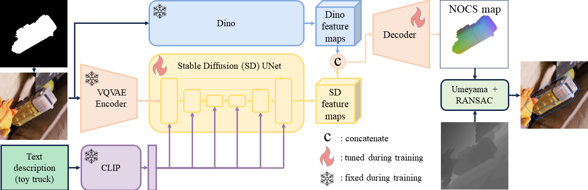

<div align="center">

## OV9D: Open-Vocabulary Category-Level 9D Object Pose and Size Estimation

[Junhao Cai](https://scholar.google.com/citations?hl=zh-CN&user=GeSCNR4AAAAJ)<sup>1*</sup>, [Yisheng He](https://github.com/ethnhe)<sup>2*</sup>, [Weihao Yuan](https://weihao-yuan.com/)<sup>2</sup>, [Siyu Zhu](https://scholar.google.co.uk/citations?user=GHOQKCwAAAAJ&hl=en)<sup>3</sup>, [Zilong Dong](https://scholar.google.co.uk/citations?user=GHOQKCwAAAAJ&hl=en)<sup>2</sup>, [Liefeng Bo](https://research.cs.washington.edu/istc/lfb/)<sup>2</sup>, [Qifeng Chen](https://cqf.io)<sup>1</sup>

<p><sup>1</sup>The Hong Kong University of Science and Technology, &nbsp;&nbsp;<sup>2</sup>Alibaba Group, &nbsp;&nbsp;<sup>3</sup>Fudan University &nbsp;&nbsp;
<br><sup>*</sup>Equal contribution

[Project Page](https://ov9d.github.io/) | [Paper](https://arxiv.org/abs/2403.12396)
</div>




### Environment

```bash
git clone https://github.com/caijunhao/ov9d.git
cd ov9d
conda env create --file env.yml
conda activate ov9d
```

### Dataset


You can have access to the data by running the script
```bash
python download_data.py
```
If you want to download the object mesh models or the multi-object data, you can run the script with ```--models``` or ```--multi```. 
```bash
python download_data.py --models --multi
```
Split train and test data
```bash
python prepare_data.py
```

The structure of the dataset is organized as follow:

```
├── ov9d
│   | cid2oid.json  # mapping from class id to object id
│   | class_list.json  # name list of object category
│   | models_info.json  # model information in BOP format
│   | models_info_with_symmetry.json  # model information with symmetry axes
│   | name2oid.json  # mapping from object category to object id
│   | oid2cid.json  # mapping from object id to class id
│   | oo3d9dsingle_class_embeddings.json  # saved text features of object descriptions
│   | models
│     ├── obj_000001.ply
│     ├── ...
│   | models_eval
│     ├── obj_000001.ply
│     ├── ...
│   | oo3d9dsingle
│     ├── anise_001_xxx  # data folder for the object anise_001 organized in BOP format
│     ├── ...
│   | oo3d9dsingle
│     ├── oo3d-xxx  # data folder for the multiple objects organized in BOP format
│     ├── ...
│   | train  # folder containing softlinks of folders from oo3d9dsingle
│     ├── anise_001_xxx  # softlink of oo3d9dsingle/anise_001_xxx
│   | test  # folder containing softlinks of folders from oo3d9dsingle
│     ├── bowl  # folder of object instances with bowl category
│         ├── bowl_001_xxx  # softlink of oo3d9dsingle/bowl_001_xxx
│     ├── ...
│   | pretrained_model
│     ├── model.ckpt  # trained checkpoint
```

### Training

```
./train.sh
```

### Test
Here is an example of evaluation on object instances with bowl category using our training model. 

```
./test.sh test/bowl ov9d/pretrained_model/model.ckpt
```

### BibTex
If you find this project useful in your research, please cite:

```bibtex
@article{cai2024ov9d,
  title={Ov9d: Open-vocabulary category-level 9d object pose and size estimation},
  author={Cai, Junhao and He, Yisheng and Yuan, Weihao and Zhu, Siyu and Dong, Zilong and Bo, Liefeng and Chen, Qifeng},
  journal={arXiv preprint arXiv:2403.12396},
  year={2024}
}
```

### Acknowledgements
This project is developed upon [VPD](https://github.com/wl-zhao/VPD), [stable-diffusion](https://github.com/CompVis/stable-diffusion), and [NOCS](https://github.com/hughw19/NOCS_CVPR2019). We thank the authors for open sourcing their great works!